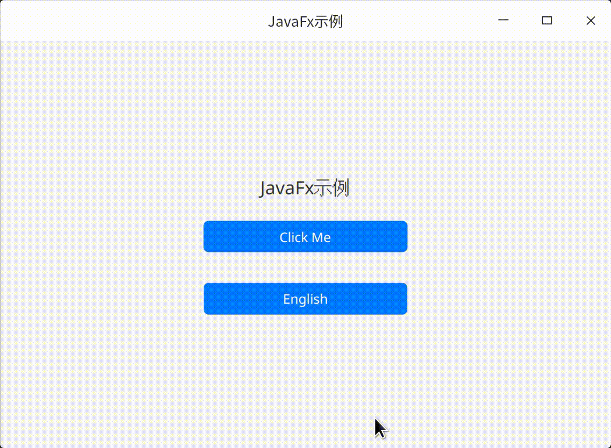

# JavaFxSample

JavaFx示例项目

演示使用[nesp-gradle-plugin-javafx](https://github.com/nespjin/nesp-gradle-plugin-javafx) 和
[nesp-sdk-javafx](https://github.com/nespjin/nesp-sdk-javafx)
开发JavaFx应用



### ViewBinding
```java
package com.nesp.javafx.sample;

import com.nesp.sdk.java.lang.SingletonFactory;
import com.nesp.sdk.javafx.BaseStage;
import javafx.beans.property.IntegerProperty;
import javafx.beans.property.SimpleIntegerProperty;
import javafx.beans.property.SimpleStringProperty;
import javafx.beans.property.StringProperty;
import javafx.event.EventHandler;
import javafx.scene.input.MouseEvent;
import javafx.stage.Stage;
import org.jetbrains.annotations.NotNull;

import java.util.Locale;
import java.util.Objects;

public class MainStage extends BaseStage {

    private static final String TAG = "MainStage";

    private MainStage() {
        //no instance
    }

    private MainStageViewBinding mBinding;

    private static boolean isShown = false;

    public static void showWindow() {
        if (isShown) return;
        var shared =
                SingletonFactory.getWeakInstance(MainStage.class, MainStage::new);
        shared.show();
        isShown = true;
    }

    @Override
    public void onCreate(final @NotNull Stage stage) {
        super.onCreate(stage);
        initializeViews();
    }

    private void initializeViews() {
        mBinding = MainStageViewBinding.inflate(R.layout.main_stage);
        setContent(mBinding.getRoot());
        final String title = getResource().getString(R.string.app_name);
        setTitle(title);

        StringProperty buttonText = new SimpleStringProperty("Click Me");

        IntegerProperty clickCount = new SimpleIntegerProperty() {
            @Override
            protected void invalidated() {
                super.invalidated();
                buttonText.setValue("Clicked " + get());
            }
        };

        mBinding.btn_click.setOnMouseClicked(event -> clickCount.set(clickCount.get() + 1));
        mBinding.btn_click.textProperty().bind(buttonText);

        mBinding.btn_switch_lang.setOnMouseClicked(new EventHandler<MouseEvent>() {
            @Override
            public void handle(final MouseEvent event) {
                if (Objects.equals(Locale.getDefault().getLanguage(), "zh")) {
                    Locale.setDefault(Locale.ENGLISH);
                    mBinding.btn_switch_lang.setText("中文");
                } else {
                    Locale.setDefault(Locale.SIMPLIFIED_CHINESE);
                    mBinding.btn_switch_lang.setText("English");
                }

                recreate();
            }
        });

        if (!Objects.equals(Locale.getDefault().getLanguage(), "zh")) {
            mBinding.btn_switch_lang.setText("中文");
        } else {
            mBinding.btn_switch_lang.setText("English");
        }
    }


}

```

## 打包

1. 使用[jlink](https://docs.oracle.com/en/java/javase/17/docs/specs/man/jlink.html) 生成自定义JRE
2. 使用[jpackage](https://docs.oracle.com/en/java/javase/17/docs/specs/man/jpackage.html) 打包成安装包


## 优化
使用[gluonfx-gradle-plugin](https://github.com/gluonhq/gluonfx-gradle-plugin) 与 [GraalVM](https://github.com/gluonhq/graal/), 编译成Native程序包